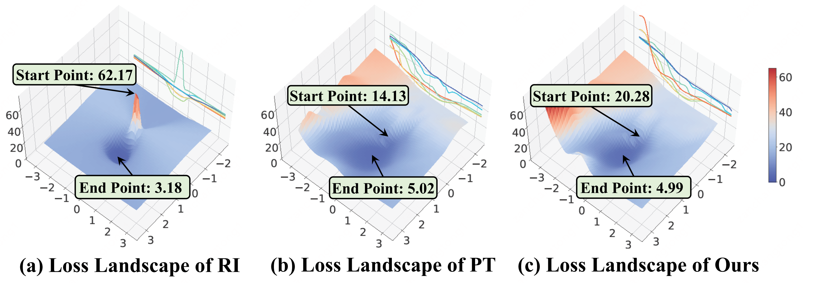
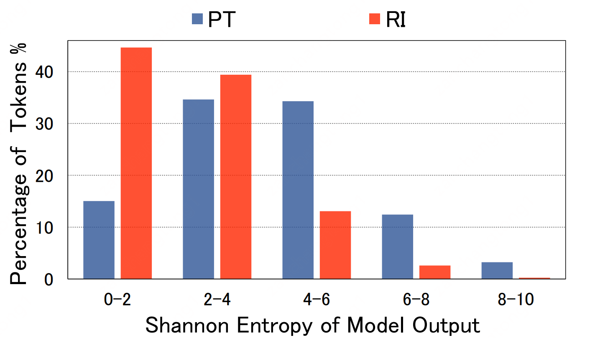

# PTvsRI
Code of our paper "On the Complementarity between Pre-Training and Random-Initialization for Resource-Rich Machine Translation"

## Requirements
To install requirements, run `conda env create -f PTvsRI.yaml`.

As we reuse hyper-parameters saved in fairseq_mode.pt, running in the same environment of model training is recommended.

## Loss Landscape
see analysis/lls_clean.py 


## Lexical Prob. Distribution
see analysis/lpd_clean.py


## Train and evaluate
see exps/README.md

## Analysis
1. Effects of Model Generalization
   See analysis/OD/eval_ende_cross_domain.sh
2. Performance Drop under Attack
   See analysis/DuA/robust_add_noisy.sh
3. Effects of Translation Diversity
   See analysis/multi-refs/eval_ende_multi_reference.sh
4. Effects of TTR
   See analysis/TTR/TTR.sh

## Citation
If our method and code help you, please considering cite our work:

```bibtex
@inproceedings{zan2022PTvsRI,
    title = {On the Complementarity between Pre-Training and Random-Initialization for Resource-Rich Machine Translation},
    author = {Zan, Changtong and Ding, Liang and Shen, Li and Cao, Yu  and Liu, Weifeng and Tao, Dacheng},
    booktitle = {COLING},
    year = {2022}
}
```